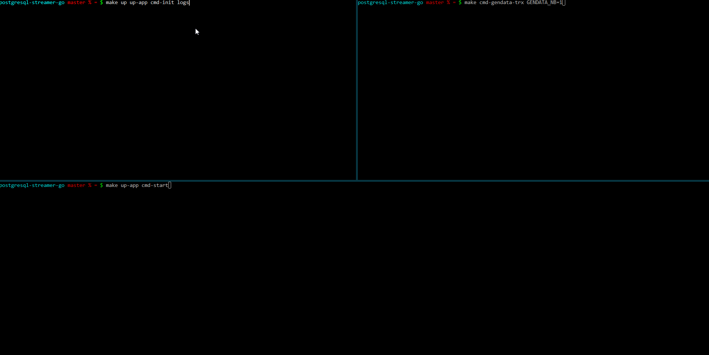

### PostgreSQL Streamer



#### Development

In 1st console, execute
```
make up logs
```

In 2nd console, execute
```
make up-app cmd-init-db cmd-start
```

In 3rd console, execute
```
make cmd-gendata
```

Modify code source, then repeat 2nd, 3rd steps

#### Main Makefile targets

Start PostgreSQL & RabbitMQ
```
make up
```

Build binary
```
make up-app
```

Build binary & run `wal start`
```
make up-app cmd-start
```

Generate data
```
make cmd-gendata [GENDATA_NB=3]
```

Database manipulation
```
make cmd-initdb # Schema is only created when inexistent
make cmd-reinitdb
```
